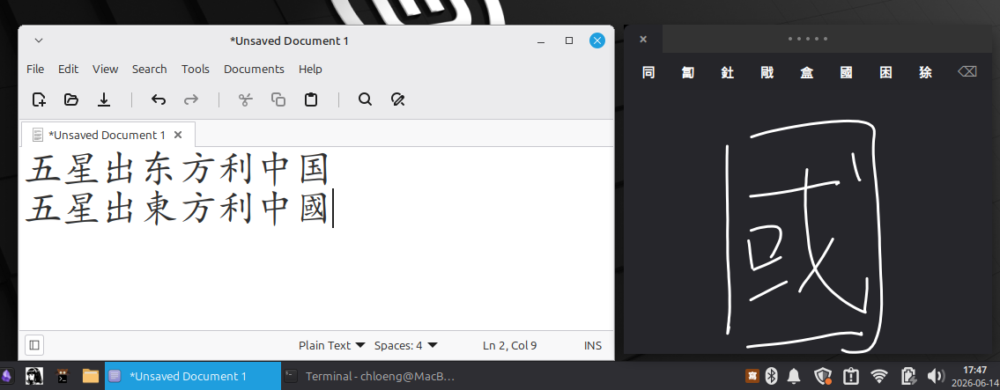

# IBus Chinese Handwriting Input Method

[](https://github.com/ai-space-lab/ibus-handwrite-chinese/actions/workflows/ci.yml)
[](https://github.com/ai-space-lab/ibus-handwrite-chinese/actions/workflows/release.yml)

**English** · [简体中文](README.zh-Hans-汉.md) · [繁體中文](README.zh-Hant-漢.md)

A Chinese handwriting input method for Linux with a macOS-style floating panel, evdev trackpad integration, and PP-OCRv6 ONNX deep-learning recognition (18710 chars).



## Features

- **macOS-style popup**: dark floating window with embedded candidates at the top
- **evdev trackpad input**: draw characters on your laptop's trackpad — works on any trackpad with BTN_TOUCH + ABS_X/ABS_MT_POSITION_X support (tested on MacBook Pro bcm5974 — other trackpads with BTN_TOUCH + ABS_X/ABS_MT_POSITION_X support may work but are untested)
- **Tap to select**: quickly tap on the trackpad to pick a candidate — spatial mapping matches candidate position
- **Two-finger swipe**: swipe left/right with two fingers to page through candidates
- **Swipe momentum**: fast two-finger swipe decelerates through multiple pages — the faster you swipe, the more pages it advances
- **1-finger candidate drag**: drag one finger in the top 5% trackpad zone to highlight candidates by position, lift to select
- **Non-destructive multitouch**: accidental second finger during a stroke won't destroy the partial stroke — the engine saves and restores stroke state
- **Delete stroke**: ⌫ button to undo the last stroke
- **Close button**: × button always visible at top-left, closes and restores previous input method
- **ESC state machine**: one ESC pauses (ungrab trackpad, show "Paused" overlay), another ESC closes and restores the previous input method; click the window to resume
- **Cursor-proximity positioning**: popup appears near the text cursor, not at a fixed screen position
- **Drag handle**: custom drag handle in the top bar to reposition the window
- **Mouse fallback**: if no evdev trackpad is available, draw with the mouse
- **PP-OCRv6 deep-learning engine**: ONNX-based CNN recognition covering 18,710 characters, with MAX-pooled confidence scoring for reliable top-1 predictions
- **'--test' mode**: standalone GTK window (no IBus dependency) for quick testing, data collection, and debugging

## Cross-Distro Support

`bootstrap.sh` auto-detects your Linux distribution and installs everything:

| Distro | Method |
|--------|--------|
| Debian 12+, Ubuntu 22.04+, Mint 21+ | `apt` + model download |
| Fedora 40+ | `dnf` + model download |
| Arch Linux, Manjaro | `pacman` + `yay` (AUR) + download |
| openSUSE Tumbleweed | `zypper` + download |

The installer downloads the PP-OCRv6 ONNX model and character dictionary for recognition.

## Requirements

- Linux with a trackpad (or touchscreen)
- IBus input method framework (default on most desktops)
- **Debian family**: Debian 11+, Ubuntu 22.04+, Linux Mint 21+
- **Fedora**: Fedora 40+
- **Arch**: Arch Linux, Manjaro
- **openSUSE**: Tumbleweed

## Quick Install

```bash
bash <(curl -s https://raw.githubusercontent.com/ai-space-lab/ibus-handwrite-chinese/main/bootstrap.sh)
ibus restart
```

**Debian/Ubuntu/Mint** users can also use the traditional method:

```bash
sudo apt install python3-evdev
git clone https://github.com/ai-space-lab/ibus-handwrite-chinese
cd ibus-handwrite-chinese
sudo ./install.sh          # add --skip-deps if you already installed dependencies
ibus restart
```

`install.sh` automatically downloads the PP-OCRv6 ONNX model and character dictionary.

Then switch the engine:

```bash
ibus engine handwrite-chinese
```

Or select **Chinese Handwriting** from your desktop's IBus menu.

## Packages

Pre-built packages are available on the [GitHub Release](https://github.com/ai-space-lab/ibus-handwrite-chinese/releases) page:

| Format | Command | Distros |
|--------|---------|---------|
| `.deb` | `sudo dpkg -i <file> && sudo apt install -f` | Debian 11+, Ubuntu 22.04+, Mint 21+ |
| `.rpm` | `sudo rpm -i <file>` | Fedora 40+, openSUSE Tumbleweed |
| `PKGBUILD` | Reference in `packaging/PKGBUILD` | Arch Linux (submit to AUR manually) |

Packages are built automatically by CI on tag push. Post-install downloads the PP-OCRv6 ONNX model and character dictionary.

## Usage

1. Switch to **Chinese Handwriting** from your IBus menu
2. A dark floating panel appears near your text cursor
3. Draw Chinese characters on your laptop's trackpad with one finger
4. Candidate characters appear at the top of the panel
5. Tap on the trackpad to select a candidate (spatial mapping)
6. Use two-finger swipe left/right to page through candidates — swipe faster to advance more pages with momentum
7. Drag one finger near the top edge of the trackpad to highlight candidates by position; lift to select
8. Press **⌫** to undo the last stroke
9. Click **×** at top-left to close and restore previous input method, or press **ESC** once to pause
10. **ESC** again closes and restores previous input method
11. Click the window to resume after pausing
12. For testing without IME switching, run `python3 src/ibus-engine-handwrite-chinese --test` in a terminal — a standalone GTK window appears and recognition results are logged to `/tmp/ppocr-recognition.log`

## Troubleshooting

- **Trackpad not accessible**: Run `sudo udevadm trigger` to apply the udev rule, or add your user to the `input` group: `sudo usermod -a -G input $USER && reboot`
- **IBus not seeing the engine**: Run `ibus restart` after installation
- **Engine won't start**: Check `journalctl -f` while switching to the engine for error messages
- **Permission denied**: Verify with `getfacl /dev/input/event*` — your user should have `rw` access on the trackpad device

## Testing

Two workflows cover development and releases:

### Main CI

[Main CI](.github/workflows/ci.yml) runs on every push/PR to `main` across 5 Docker containers:
- **lint**: shellcheck, xmllint, Python syntax checks
- **test-install**: installs dependencies per distro, checks Python syntax
- **test-bootstrap**: full bootstrap.sh end-to-end run, verifies installed files and model placement, runs recognition smoke test
- **test-gtk-write**: GTK writing simulation across 10 distro versions, captures screenshots as artifacts

Containers tested: `debian:bookworm`, `ubuntu:24.04`, `fedora:latest`, `archlinux:latest`, `opensuse/tumbleweed`.

### Release

[Release](.github/workflows/release.yml) runs on `v*` tag pushes or manual dispatch:
- resolve release tag/version
- build `.deb`, `.rpm`, and source tarball
- verify packaged artifacts
- upload release assets to GitHub Release

### Recognition Smoke Test

The recognition smoke test (`tests/test_recognition.py`) creates synthetic strokes:
- Horizontal line → recognized as **一** (score > 0.9)
- Cross shape → recognized as **十** (score > 0.95)

CI tests GTK under Xvfb, but not live IBus, evdev, or real trackpad hardware in containers.

### PP-OCRv6 Accuracy Validation

Analysis scripts for validating PP-OCRv6 recognition accuracy:
- `scripts/collect_ppocr_data.py` — Interactive data collection via `--test` mode (or `--prompt` / `--free` modes)
- `scripts/analyze_ppocr_data.py` — Accuracy, confidence histogram, calibration, stroke complexity, and dict index analysis
- `scripts/capture_one.py` — Single-stroke capture and recognition test
- `scripts/gtk_collect_loop.py` — Batch collection using log-file polling with `--test` mode

Run the full analysis pipeline:
```bash
python3 scripts/analyze_ppocr_data.py --input .omo/evidence/ppocr-handwriting-dataset/dataset-chat-v1.json --verbose
```

## Known Limitations

- **Real hardware**: Tested on MacBook Pro (bcm5974) — should work on any touchpad with `BTN_TOUCH + ABS_X`, but Wayland popup positioning and SELinux evdev access are untested on Fedora/Arch.
- **Recognition accuracy**: Pure PP-OCRv6 ONNX recognition (18710 chars). Validated at 100% top-1 accuracy on 40 real handwriting characters (36 distinct chars, including 7 similar-pair groups: 土/士, 未/末, 日/曰, 人/入, 大/太, 已/己, 上/下). Average confidence: 94.97%.
- **Single character**: No multi-character composition yet (one character at a time). V2 may add spatial segmentation for sequential input.

## Acknowledgments

- **PP-OCRv6** — text recognition model by [PaddlePaddle](https://github.com/PaddlePaddle/PaddleOCR) / Baidu, licensed under [Apache 2.0](https://github.com/PaddlePaddle/PaddleOCR/blob/main/LICENSE).
- **ONNX Runtime** — cross-platform inference engine by Microsoft, licensed under [MIT](https://github.com/microsoft/onnxruntime/blob/main/LICENSE).

## License

GPLv3 — required by dependencies (python3-evdev, ibus).

## PP-OCRv6 Integration

The engine uses a PP-OCRv6 ONNX model (MobileNetV3 small, trained on 18,710 Chinese characters) for recognition.

### Setup

1. Download the PP-OCRv6 ONNX model and dictionary via `bootstrap.sh` or `install.sh`
2. Set the ONNX model path via environment variable:
   ```bash
   export IBUS_HANDWRITE_PPOCR_MODEL=small  # or: large, server (default: small)
   export IBUS_HANDWRITE_PPOCR_MODEL_PATH=/tmp/models/ppocrv6_small.onnx
   export IBUS_HANDWRITE_PPOCR_DICT_PATH=/tmp/models/dict_v6.txt
   ```
3. Switch the engine as normal:
   ```bash
   ibus engine handwrite-chinese
   ```

### Testing Without IBus

Run the engine in standalone `--test` mode to test recognition without switching IME:
```bash
python3 src/ibus-engine-handwrite-chinese --test
```
This opens a GTK floating window where you can draw characters. Recognition results appear in `/tmp/ppocr-recognition.log`.

### Bug Fixes Applied

Three bugs were identified and fixed in the PP-OCRv6 pipeline during validation:

1. **Dict index corruption** (line 290): `line.strip()` stripped U+3000 (ideographic space) from a dict entry, shifting all subsequent character indices by 1. Fixed with `line.rstrip('\n')`.
2. **Confidence pooling** (line 405): `np.mean(probs, axis=0)` averaged across all CTC time steps including blank frames, diluting true confidence by ~10×. Fixed with `np.max(probs, axis=0)` (MAX pooling) which matches CTC argmax behavior for single-character recognition.
3. **Stroke line width** (line 364): `cr.set_line_width(6)` rendered strokes thinner than the training data distribution. Increased to `set_line_width(8)`.

### Validation Results

40 real handwriting characters collected via `--test` mode and trackpad input:

| Metric | Result |
|--------|--------|
| Top-1 accuracy | 40/40 (100%) |
| Top-5 accuracy | 40/40 (100%) |
| Average confidence | 94.97% |
| Min confidence | 34.47% (小) |
| Max confidence | 100.00% (月, 女, etc.) |
| Similar pairs tested | 7 groups, 14/14 correct |

Characters tested: 一 七 三 上 下 不 中 九 二 五 人 入 八 六 十 口 四 土 士 大 天 太 女 好 小 山 己 已 心 文 日 曰 月 木 未 末 水 火 王 田

Full analysis report: `.omo/evidence/ppocr-handwriting-dataset/analysis-report.json`
Bottleneck report: `.omo/evidence/ppocr-handwriting-dataset/bottleneck-report.txt`

## Repository Structure

```
├── scripts/
│   ├── analyze_ppocr_data.py          PP-OCRv6 accuracy analysis pipeline
│   ├── collect_ppocr_data.py          Interactive handwriting data collection
│   ├── capture_one.py                 Single-shot capture helper
│   ├── gtk_collect_loop.py            Log-based GTK collection script
│   └── read_last_log.py               Recognition log reader
├── src/
│   ├── ibus-engine-handwrite-chinese    Main engine (Python, GTK popup, evdev integration)
│   └── handwrite_evdev.py               Evdev multitouch reader module
├── xml/
│   └── handwrite-chinese.xml               IBus component XML
├── icons/
│   └── handwrite-chinese.svg               Engine icon
├── tools/
│   ├── install.sh                       Install script (Debian-native, accepts `--skip-deps`)
│   ├── restore.sh                       Rollback/restore script
│   └── 99-trackpad-handwrite.rules      Udev rule for trackpad access
├── tests/
│   ├── test_recognition.py             Synthetic stroke recognition smoke test
│   └── test_data/                      Test stroke data
├── docs/
│   └── screenshot.png                  App screenshot
│   ├── plan-handwriting-accuracy-test.md Historical accuracy test methodology
│   └── multi-char-composition-with-phrase-boost-plan.md  V2 feature plan
├── models/                              Local model cache (gitignored)
├── packaging/                            Debian packaging, RPM spec, PKGBUILD
├── .github/workflows/
│   ├── ci.yml                          Main CI — 5 distros
│   └── release.yml                     Release build, verify, upload
├── .omo/
│   └── evidence/ppocr-handwriting-dataset/  Accuracy validation evidence
│       ├── dataset-chat-v1.json             40 handwriting samples, 100% accuracy
│       ├── analysis-report.json             Full analysis report with metrics
│       └── bottleneck-report.txt            Bug fix and validation report
├── bootstrap.sh                        Cross-distro install entry point
├── README.md
├── README.zh-Hans-汉.md
└── README.zh-Hant-漢.md
```
