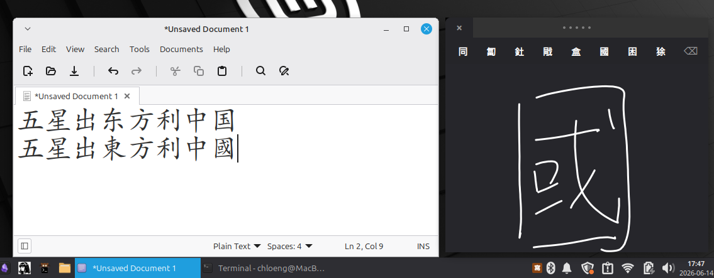
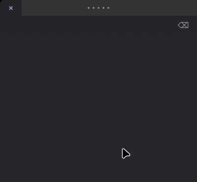

# IBus 中文手写输入法

[](https://github.com/ai-space-lab/ibus-handwrite-chinese/actions/workflows/ci.yml)
[](https://github.com/ai-space-lab/ibus-handwrite-chinese/actions/workflows/release.yml)

一款 Linux 平台的中文手写输入法，采用 macOS 风格浮动面板、evdev 触控板集成和 PP-OCRv6 ONNX 深度学习引擎。



## 快速安装



在任何受支持的发行版上，最快的安装方式是：

```bash
bash <(curl -s https://raw.githubusercontent.com/ai-space-lab/ibus-handwrite-chinese/main/bootstrap.sh)
ibus restart
```

### 我该用哪种安装方式？

回答三个简单的问题，选出最适合你的路径：

1. **用哪个发行版？**
   - **Debian / Ubuntu / Mint** → `bootstrap.sh`（自动）或 `.deb` 软件包
   - **Fedora** → `bootstrap.sh`（自动）或 `.rpm` 软件包
   - **Arch / Manjaro** → `bootstrap.sh`（自动）或从 `PKGBUILD` 构建
   - **openSUSE** → `bootstrap.sh`（自动）或 `.rpm` 软件包
2. **想要一条命令还是手动装包？**
   - **一条命令（推荐）** → `bootstrap.sh` 会自动检测发行版并安装全部依赖
   - **手动装包** → 从 [GitHub Releases](https://github.com/ai-space-lab/ibus-handwrite-chinese/releases) 下载 `.deb` / `.rpm` 并安装
3. **是否偏好从源码构建？**
   - **是** → 克隆仓库并运行 `install.sh`（步骤见下文）
   - **否** → 继续使用 `bootstrap.sh` 或软件包

> 各发行版的具体步骤与故障排除折叠面板，请参阅[完整安装指南](docs/index.md)。

**Debian/Ubuntu/Mint** 用户也可以使用传统方式：

```bash
sudo apt install python3-evdev python3-venv
git clone https://github.com/ai-space-lab/ibus-handwrite-chinese
cd ibus-handwrite-chinese
./tools/install.sh    # 若依赖已安装可加 --skip-deps（脚本内部会使用 sudo）
ibus restart
```

`install.sh` 会自动完成以下操作：
- 下载 PP-OCRv6 ONNX 模型与字符字典
- 创建带有 onnxruntime 的 Python 虚拟环境
- 安装一个包装脚本作为引擎可执行文件
- 重启 IBus 并将"中文手写"激活为当前输入法

也可以从桌面环境的 IBus 菜单中选择 **Chinese Handwriting**。

之后如需切回之前的输入法，使用 IBus 菜单或：
```bash
ibus engine <previous-engine>
```

### 故障排除快速链接

- **触控板权限**：将用户加入 `input` 组：`sudo usermod -a -G input $USER && reboot`，或运行 `sudo udevadm trigger`
- **IBus 无法启动**：运行 `ibus restart`，然后 `ibus engine handwrite-chinese`
- **模型下载**：在偏好设置对话框中选择模型等级（`ibus-engine-handwrite-chinese --setup`），或参见[故障排除](#故障排除)

## 功能特点

- **macOS 风格弹出面板**：深色浮动窗口，候选词嵌入面板顶部
- **evdev 触控板输入**：在笔记本电脑触控板上书写汉字 —— 支持所有支持 BTN_TOUCH + ABS_X/ABS_MT_POSITION_X 的触控板（已在 MacBook Pro bcm5974 上测试通过——其他支持 BTN_TOUCH + ABS_X/ABS_MT_POSITION_X 的触控板可能可用，但未经测试）
- **点击选择**：轻触触控板即可选择候选词 —— 空间映射匹配候选词位置
- **双指滑动**：双指左右滑动翻页浏览候选词
- **滑动惯性**：快速双指滑动会惯性减速穿越多页 —— 滑得越快，翻页越多
- **单指候选拖动**：在触控板顶部 5% 区域内单指拖动，按位置高亮候选词，抬指选择
- **非破坏性多点触控**：书写时意外触碰到第二根手指不会破坏当前笔画 —— 引擎会自动保存和恢复笔画状态
- **删除笔画**：⌫ 按钮可撤销上一笔画
- **关闭按钮**：左上角始终显示 × 按钮，点击关闭并恢复上一输入法
- **ESC 状态机**：按一次 ESC 暂停（释放触控板，显示"已暂停"遮罩），再按一次 ESC 关闭并恢复上一输入法；点击窗口恢复。**Enter 有候选字时**提交首个候选字；**Enter 无候选字时**传递到下层应用程序。
- **智能窗口定位**：弹出面板自动出现在文本光标附近，不遮挡应用程序视图
- **拖拽手柄**：顶部栏自定义拖拽手柄可随意移动窗口位置
- **鼠标后备**：如无 evdev 触控板，可使用鼠标绘图
- **偏好设置对话框**：6 标签 GTK3 设置界面（通用、模型、引擎、窗口、用户词典、快捷键）—— 可从 IBus 菜单或通过 `ibus-engine-handwrite-chinese --setup` 打开
- **按需模型下载**：直接从偏好设置对话框下载 PP-OCRv6 模型（tiny/small/medium），自动使用 pkexec 提权进行系统级安装
- **自动下载提示**：选择未下载的模型等级时自动询问是否立即下载
- **可配置键盘快捷键**：通过快捷键标签页自定义所有按键绑定（ESC、Enter、Backspace、翻页、主题切换、设置）
- **用户词典**：通过本地 SQLite 数据库学习用户选择的汉字，在后续识别中提升其优先级
- **TOML 配置文件**：所有设置存储在 `~/.config/ibus-handwrite-chinese/config.toml`，可通过 `IBUS_HANDWRITE_*` 环境变量覆盖
- **PP-OCRv6 深度学习引擎**：基于 ONNX 的 CNN 识别，覆盖 18710 个汉字，使用 MAX 池化置信度评分
- **'--test' 测试模式**：独立 GTK 窗口（无需 IBus），适合快速测试、数据采集和调试

## 跨发行版支持

`bootstrap.sh` 自动检测您的 Linux 发行版并安装全部依赖：

| 发行版 | 安装方式 | 模型来源 |
|--------|----------|----------|
| Debian 12+, Ubuntu 22.04+, Mint 21+ | `apt` + 下载 | 系统包 + PP-OCRv6 ONNX 模型 |
| Fedora 40+ | `dnf` + 下载 | PP-OCRv6 ONNX 模型 |
| Arch Linux, Manjaro | `pacman` + `yay` (AUR) + 下载 | PP-OCRv6 ONNX 模型 |
| openSUSE Tumbleweed | `zypper` + 下载 | PP-OCRv6 ONNX 模型 |

安装程序自动下载 PP-OCRv6 ONNX 模型（覆盖 18710 个汉字）用于深度学习识别。

## 系统要求

- Linux 系统，带触控板（或触摸屏）
- IBus 输入法框架（大多数桌面环境默认安装）
- **Debian 系列**：Debian 11+，Ubuntu 22.04+，Linux Mint 21+
- **Fedora**：Fedora 40+
- **Arch**：Arch Linux，Manjaro
- **openSUSE**：Tumbleweed

## 软件包

预构建的软件包可在 [GitHub Release](https://github.com/ai-space-lab/ibus-handwrite-chinese/releases) 页面下载：

| 格式 | 安装命令 | 发行版 |
|------|----------|--------|
| `.deb` | `sudo dpkg -i <file> && sudo apt install -f` | Debian 11+, Ubuntu 22.04+, Mint 21+ |
| `.rpm` | `sudo rpm -i <file>` | Fedora 40+, openSUSE Tumbleweed |
| `PKGBUILD` | 参考 `packaging/PKGBUILD` | Arch Linux（需手动提交到 AUR）|

软件包在推送标签时由 CI 自动构建。安装后自动下载 PP-OCRv6 ONNX 模型（非致命失败）。

## 使用方法

1. 从 IBus 菜单切换到 **Chinese Handwriting**
2. 深色浮动面板将出现在您的文本光标附近
3. 用单指在触控板上书写汉字
4. 候选字显示在面板顶部
5. 轻触触控板选择候选词（空间映射）
6. 双指左右滑动翻页
7. 按 **⌫** 撤销上一笔画
8. 按 **ESC** 暂停（窗口显示"已暂停"遮罩）
9. 再按 **ESC** 关闭并恢复上一输入法
10. 点击窗口恢复（暂停状态下）
11. 当无候选字时（未绘制笔画），**Enter** 键传递到应用程序 — 可在终端正常打字
12. 如需不切换 IME 进行测试，使用 venv Python：
    ```bash
    /usr/local/share/ibus-handwrite-chinese/venv/bin/python3 \
      /usr/local/share/ibus-handwrite-chinese/ibus-engine-handwrite-chinese --test
    ```
    识别结果记录到 `/tmp/ppocr-recognition.log`。

## 故障排除

- **触控板无法使用**：运行 `sudo udevadm trigger` 应用 udev 规则，或将用户加入 `input` 组：`sudo usermod -a -G input $USER && reboot`
- **IBus 未识别输入法**：安装后运行 `ibus restart`
- **输入法无法启动**：切换到输入法时查看 `journalctl -f` 获取错误信息
- **权限被拒绝**：用 `getfacl /dev/input/event*` 验证 —— 您的用户应对触控板设备有 `rw` 权限
- **ESC 不工作 / Enter 被引擎拦截**：如果按 ESC 暂停后 Enter 无法传递到终端，请用最新版 `install.sh` 重新安装。修复确保：(1) 无候选字时 Enter 可通过，(2) 暂停状态下按 ESC 关闭并恢复上一输入法，(3) ESC 现在可在 Firefox 和其他设置 IBUS_RELEASE_MASK 的应用程序中正常工作。

## 测试

两个工作流分别覆盖开发和发布：

### 主 CI

[主 CI](.github/workflows/ci.yml) 在每次推送/PR 到 `main` 时运行，覆盖 5 个 Docker 容器：
- **lint**：shellcheck、xmllint、Python 语法检查
- **test-install**：按发行版安装依赖，验证 ONNX 运行时加载，检查 Python 语法
- **test-bootstrap**：完整运行 bootstrap.sh，验证安装文件和模型，运行识别冒烟测试
- **test-gtk-write**：在 10 个发行版版本上运行 GTK 书写模拟，并上传截图产物

测试容器：`debian:bookworm`、`ubuntu:24.04`、`fedora:latest`、`archlinux:latest`、`opensuse/tumbleweed`。

### 发布

[Release](.github/workflows/release.yml) 在 `v*` 标签推送或手动触发时运行：
- 解析发布标签和版本号
- 构建 `.deb`、`.rpm` 和源码 tarball
- 验证发布产物
- 上传发布资产到 GitHub Release

### 识别冒烟测试

识别冒烟测试（`tests/test_recognition.py`）创建合成笔画：
- 水平线 → 识别为 **一**（得分 > 0.9）
- 十字形 → 识别为 **十**（得分 > 0.95）

CI 会在 Xvfb 下测试 GTK，但不会在容器中测试真实 IBus、evdev 或触控板硬件。

### 手动测试环境

最近的 ESC/Enter 修复在此环境下验证通过：

| 组件 | 详情 |
|------|------|
| 操作系统 | Linux Mint 22.3 (Zena) XFCE |
| 内核 | 6.14.0-37-generic (x86_64) |
| 桌面环境 | XFCE on X11 |
| IBus | 1.5.29-rc2 |
| Python | 3.12.3 |
| 触控板 | bcm5974（MacBook Pro，USB） |
| 安装方式 | `sudo ./tools/install.sh` 或 `.deb` 包 |

### PP-OCRv6 精度验证

用于验证 PP-OCRv6 识别精度的分析脚本：
- `scripts/collect_ppocr_data.py` — 通过 `--test` 模式（或 `--prompt` / `--free` 模式）交互式采集数据
- `scripts/analyze_ppocr_data.py` — 精度、置信度直方图、校准、笔画复杂度及字典索引分析
- `scripts/capture_one.py` — 单笔画采集与识别测试
- `scripts/gtk_collect_loop.py` — 通过日志轮询配合 `--test` 模式的批量采集

运行完整分析流程：
```bash
python3 scripts/analyze_ppocr_data.py --input .omo/evidence/ppocr-handwriting-dataset/dataset-chat-v1.json --verbose
```

## 已知限制

- **实机测试**：在 MacBook Pro（bcm5974）上测试通过 —— 应适用于任何支持 `BTN_TOUCH + ABS_X` 的触摸板，但 Fedora/Arch 上的 Wayland 弹出面板定位和 SELinux evdev 访问尚未测试
- **识别精度**：使用 PP-OCRv6（18710 字，ONNX）深度学习引擎。经 40 个真实手写字符验证（36 个不同字，含 7 组相似字：土/士、未/末、日/曰、人/入、大/太、已/己、上/下），首选识别率 100%，平均置信度 94.97%
- **单字输入**：暂不支持多字组合（一次输入一个字）。V2 版本可能加入空间分割实现连续输入
- **ONNX 模型下载**：PP-OCRv6 模型托管在 GitHub Releases。如果下载失败，安装程序将发出警告并继续。CI 容器优雅跳过下载

## 致谢

- **PP-OCRv6** — 文本识别模型，由 [PaddlePaddle](https://github.com/PaddlePaddle/PaddleOCR) / 百度开发，采用 [Apache 2.0](https://github.com/PaddlePaddle/PaddleOCR/blob/main/LICENSE) 许可证。
- **ONNX Runtime** — 跨平台推理引擎，由微软开发，采用 [MIT](https://github.com/microsoft/onnxruntime/blob/main/LICENSE) 许可证。

## 许可协议

GPLv3 — 由依赖库要求（python3-evdev、ibus）。

## 配置

### 偏好设置对话框

从 IBus 菜单打开 6 标签偏好设置对话框：
- 右键点击 IBus 托盘图标 → 首选项 → Chinese Handwriting
- 或运行：`ibus-engine-handwrite-chinese --setup`
- 或在桌面设置中搜索"Chinese Handwriting"

对话框包含以下标签：

| 标签页 | 设置内容 |
|--------|----------|
| **通用** | 主题（深色/浅色/自动）、日志级别、日志路径 |
| **模型** | 模型等级（tiny/small/medium）、自定义模型/字典路径、自动下载开关、带进度指示的下载按钮 |
| **引擎** | 笔画宽度（px）、页面大小、最大候选数、惯性设置、防抖定时器 |
| **窗口** | 窗口宽/高、绘制区域高度、拖拽手柄高度、候选按钮宽度 |
| **用户词典** | 启用/禁用用户词典、提升强度、最大条目数 |
| **快捷键** | 自定义所有按键绑定（ESC、Enter、Backspace、翻页、主题切换、打开设置） |

更改在点击**应用**并重启 IBus（`ibus restart`）后生效。

### 环境变量

所有设置均可通过 `IBUS_HANDWRITE_*` 环境变量覆盖，优先级高于 TOML 配置文件：

| 变量 | 配置键 | 示例 |
|------|--------|------|
| `IBUS_HANDWRITE_THEME` | general.theme | `dark` |
| `IBUS_HANDWRITE_LOG_LEVEL` | general.log_level | `DEBUG` |
| `IBUS_HANDWRITE_PPOCR_MODEL` | model.tier | `small` |
| `IBUS_HANDWRITE_PPOCR_MODEL_PATH` | model.path | `/path/to/model.onnx` |
| `IBUS_HANDWRITE_PPOCR_DICT_PATH` | model.dict_path | `/path/to/dict.txt` |
| `IBUS_HANDWRITE_DOWNLOAD_PATH` | model.download_path | `/usr/local/share/ibus-handwrite-chinese/models` |
| `IBUS_HANDWRITE_AUTO_DOWNLOAD` | model.auto_download | `true` |
| `IBUS_HANDWRITE_STROKE_WIDTH` | engine.stroke_width | `12` |

### 模型管理

通过偏好设置对话框的**模型**标签页下载模型：

1. 从下拉菜单中选择等级（tiny / small / medium）
2. 如果模型尚未下载，系统会询问是否立即下载
3. 点击**下载模型**开始下载 — 脉冲进度条显示活动状态
4. 模型下载到系统临时目录，然后复制到目标位置（必要时使用 `pkexec` 提权）
5. 字典文件（`dict_v6.txt`）在所有等级间共享
6. 下载后重启 IBus 以使引擎加载新模型

您也可以通过**模型路径**/**字典路径**字段设置自定义路径，使用存储在别处的模型。

### 模型等级

| 等级 | 参数量 | 适用场景 |
|------|--------|----------|
| tiny | 1.5M | 快速，低资源环境 |
| small | ~8M | 速度与精度均衡（默认） |
| medium | 34.5M | 最高精度 |

### 已修复的 Bug

共发现并修复了十三个 Bug，涵盖 PP-OCRv6 管线、ESC 状态机、Firefox 兼容性、桌面/非文本区域自动暂停、模型下载、配置及偏好设置对话框：

1. **字典索引损坏**（第 290 行）：`line.strip()` 从字典条目中剥离了 U+3000（表意空格），导致后续所有字符索引偏移 1。修复为 `line.rstrip('\n')`。
2. **置信度池化**（第 405 行）：`np.mean(probs, axis=0)` 对所有 CTC 时间步（包括空白帧）取平均，使真实置信度稀释约 10 倍。修复为 `np.max(probs, axis=0)`（MAX 池化），符合单字符识别的 CTC argmax 行为。
3. **笔画线宽**（第 364 行）：`cr.set_line_width(6)` 渲染的笔画比训练数据分布更细。增加到 `set_line_width(8)`。

### 4. ESC 键可靠性 & Enter 传递（PR #1）
改进了 ESC 状态机，使其在所有状态下正确处理 Enter 键：

| 按键 | 活跃（状态 0） | 暂停（状态 1） |
|---|---|---|
| ESC | 暂停面板，显示遮罩 | 关闭 + 恢复上一 IME |
| Enter + 有候选字 | 提交首个候选字 | ✅ 传递到应用程序 |
| Enter + 无候选字 | ✅ 传递到应用程序 | ✅ 传递到应用程序 |
| Backspace | 清除笔画（传递通过） | ✅ 传递到应用程序 |

**根本原因**：`do_process_key_event` 在窗口可见时拦截 Enter/Backspace/ESC，无论暂停状态或是否存在候选字。修复方法：
- 将 ESC（始终处理）与 Enter/Backspace（仅在活跃状态 0 拦截）分离
- 添加 `self.last_results` 保护：仅在有候选字时消费 Enter
- 对 `--test` 模式使用的 GTK `on_key` 处理程序应用相同保护

### 5. `--test` 模式键盘焦点修复
独立 `--test` 模式窗口无法接收 GTK 键盘事件，因为 `__init__` 中设置了 `set_accept_focus(False)`。通过在 `main()` 中的 `win.present()` 前调用 `win.set_accept_focus(True)` 修复。

### 6. Firefox ESC 兼容性修复
Firefox 通过 IBus 发送 ESC 按键事件时会设置 `IBUS_RELEASE_MASK`（1 << 30），导致原始 ESC 处理程序在检查 `RELEASE_MASK` 时被绕过。修复方法：
- 将 ESC 检查移到 `do_process_key_event` 中的 `RELEASE_MASK` 过滤之前 —— 无论按下/释放状态，ESC 都能被处理
- 在 `on_key_esc()` 中添加 150ms 去抖，防止按下+释放事件对的双重触发
- 通过 `/tmp/hw.log` 日志分析验证，ESC → 暂停 → 关闭状态转换在 Firefox 中正常工作

### 7. 无文本焦点时 ESC 暂停修复
当无文本字段获得焦点时（例如 Firefox 标题栏、桌面），按下 ESC 暂停面板无效。存在两种按键事件路径：IBus 路径（`do_process_key_event`）需要活跃的 IBus 输入上下文（仅由文本输入控件创建），GTK 路径（`on_key` 处理程序）需要面板拥有键盘焦点 —— 被 `set_accept_focus(False)` 阻止。

**根本原因**：之前的修复尝试了 50ms 延迟焦点获取（`_grab_focus_if_needed`），但在窗口管理器处理焦点授予前立即还原了 `set_accept_focus(False)`。日志显示获取运行了但 ESC 从未到达。

**修复方法**：完全移除定时器。在 `do_enable()` 中，在 `present()` 前调用 `set_accept_focus(True)` 并在会话期间保持 True —— 与 `--test` 模式的做法一致。在 `do_disable()` 中重置为 `False`。通过 xdotool 验证：当桌面聚焦时按下 ESC，记录到 `on_key_esc: _state=0`。

### 8. 非文本区域焦点丢失时自动暂停（Firefox 标题栏、桌面背景）
当用户单击 Firefox 标题栏或桌面背景时，手写窗口仍处于打开状态，但没有任何 ESC 或键盘事件能到达窗口 —— IBus 上下文已不活跃（无文本字段），窗口也没有键盘焦点。

**根本原因**：存在两条事件路径 —— IBus 的 `do_process_key_event`（需要活跃的 IBus 输入上下文，仅由文本输入控件创建）和 GTK 的 `on_key` 处理程序（需要窗口拥有键盘焦点）。单击非文本区域后，两条路径均不可用。

**修复方法**：添加了 GTK `focus-out-event` 处理程序（`on_focus_out_event`），安排 50ms 去抖定时器。到期时，`_handle_focus_lost` 调用 `on_key_esc()` 自动暂停窗口。50ms 去抖可吸收 XFCE 在桌面点击后约 20ms 触发的虚假 `do_focus_in` 信号。自动暂停受 `_has_drawn` 保护 —— 如果用户尚未绘制任何笔画，则不会自动暂停（避免启动时的混淆行为）。

### 9. 由于 `_focused_since_enable` 竞态，第二次激活时 `present()` 被跳过
在关闭手写窗口（通过双击 ESC 或切换 IME）并第二次重新激活后，ESC 和自动暂停无声地停止工作。窗口出现了但没有键盘焦点。

**根本原因**：`_grab_focus_if_needed` 在 `do_enable()` 期间通过 `GLib.idle_add` 调度。在第二次激活时，一个虚假的 XFCE `do_focus_in` 信号在空闲处理程序运行前触发，将 `_focused_since_enable` 设置为 True。旧代码随后完全跳过了 `self.win.present()` —— 窗口可见但没有键盘焦点，因此 GTK `focus-out-event` 永远不会触发，ESC 键事件也永远不会到达。

**修复方法**：在 `_grab_focus_if_needed` 中始终调用 `self.win.present()`，无论 `_focused_since_enable` 如何。这是安全的，因为在手写模式下用户通过触控板/鼠标交互，而非键盘 —— 窗口只需要焦点来路由 ESC 和 GTK 焦点事件。

### 10. X11 属性刷新时序阻止 `present()` 授予焦点
即使在修复 #9 之后，某些第二次激活尝试仍然无法获得键盘焦点。调查显示 `on_focus_in_event` 在激活序列中缺失，尽管调用了 `present()`。

**根本原因**：`set_accept_focus(True)` 和 `present()` 都在 `_grab_focus_if_needed`（GLib 空闲处理程序）内部调用。GTK 批量处理 X11 `WM_HINTS` 属性更改 —— 当空闲处理程序运行时，`accept_focus=True` 尚未刷新到 X 服务器。窗口管理器仍然看到 `accept_focus(False)`（仍然来自之前的 `do_disable()`）并拒绝了焦点请求。

**修复方法**：在 `do_enable()` 中的 `show_all()` 和 `GLib.idle_add` 之前调用 `self.win.set_accept_focus(True)`。当空闲处理程序触发并调用 `present()` 时，X11 属性更改已刷新到服务器。窗口管理器看到 `accept_focus(True)` 并授予焦点，从而在每个激活周期产生 `on_focus_in_event`，并使 ESC 和 `on_focus_out_event` 正常工作。

### 验证结果

通过 `--test` 模式和触控板采集的 40 个真实手写字符：

| 指标 | 结果 |
|------|------|
| 首选准确率 | 40/40（100%） |
| 前五准确率 | 40/40（100%） |
| 平均置信度 | 94.97% |
| 最低置信度 | 34.47%（小） |
| 最高置信度 | 100.00%（月、女等） |
| 相似字组测试 | 7 组，14/14 正确 |

测试字符：一 七 三 上 下 不 中 九 二 五 人 入 八 六 十 口 四 土 士 大 天 太 女 好 小 山 己 已 心 文 日 曰 月 木 未 末 水 火 王 田

完整分析报告：`.omo/evidence/ppocr-handwriting-dataset/analysis-report.json`
瓶颈报告：`.omo/evidence/ppocr-handwriting-dataset/bottleneck-report.txt`

### 11. 模型下载权限错误
从偏好设置对话框下载模型时出现 `PermissionError`，原因是 `tempfile.mkdtemp()`
在 root 拥有的 `/usr/local/share/.../models/` 目录内创建了临时目录。修复方法：
改为下载到系统临时目录（`/tmp`），并使用 `shutil.move()` 配合 `pkexec cp` 回退
方案将文件最终复制到目标目录。

### 12. 显示笔画宽度忽略偏好设置
在引擎标签页中更改笔画宽度没有可见效果 — 显示绘制硬编码了 `3 * scale`
而非读取 `CONFIG["engine"]["stroke_width"]`。在 Cairo 绘制代码的两处位置修复：
`rebuild_pix()`（已完成笔画）和 `on_draw()`（实时笔画）。识别渲染（第 183 行）
已使用配置值。

### 13. 配置清理
移除了两个无效配置键：`model.variant`（PP-OCRv6 旧命名的遗留项）和
`engine.max_strokes`（在配置和偏好设置 UI 中定义但引擎从未读取）。

## 目录结构

```
├── scripts/
│   ├── analyze_ppocr_data.py          PP-OCRv6 精度分析管线
│   ├── collect_ppocr_data.py          交互式手写数据采集
│   ├── capture_one.py                 单笔画采集辅助工具
│   ├── gtk_collect_loop.py            基于日志的 GTK 采集脚本
│   └── read_last_log.py               识别日志读取器
├── src/
│   ├── ibus-engine-handwrite-chinese    主引擎（Python、GTK 弹出面板、evdev 集成）
│   ├── handwrite_config.py              TOML/环境变量配置加载器
│   ├── handwrite_model_download.py      PP-OCRv6 模型下载器（含 SHA256 校验）
│   ├── handwrite_prefs.py               6 标签 GTK3 偏好设置对话框
│   ├── handwrite_shortcuts.py           可配置的按键绑定系统
│   ├── handwrite_userdict.py            基于 SQLite 的用户字符学习模块
│   └── handwrite_evdev.py               Evdev 多点触控读取模块
├── xml/
│   └── handwrite-chinese.xml            IBus 组件
├── icons/
│   └── handwrite-chinese.svg            引擎图标
├── tools/
│   ├── install.sh                       安装脚本（Debian 原生，支持 `--skip-deps`）
│   ├── restore.sh                       回滚/恢复脚本
│   ├── 99-trackpad-handwrite.rules      触控板访问的 udev 规则
│   └── diagnose_trackpad.sh            ESC + input 组 + IBus 诊断
├── tests/
│   ├── test_recognition.py             合成笔画识别冒烟测试
│   ├── test_esc_key_routing.py         ESC 按键路由自动化测试
│   └── test_data/                      测试笔画数据
├── docs/
│   └── screenshot.png                   应用截图
│   ├── plan-handwriting-accuracy-test.md 识别精度测试方案（历史文档）
│   └── multi-char-composition-with-phrase-boost-plan.md  V2 功能规划
├── models/                              本地模型缓存（gitignore）
├── packaging/                            Debian 打包、RPM spec、PKGBUILD
├── .github/workflows/
│   ├── ci.yml                          主 CI — 5 个发行版
│   └── release.yml                     发布构建、验证、上传
├── .omo/
│   └── evidence/ppocr-handwriting-dataset/  精度验证证据
│       ├── dataset-chat-v1.json              40 个手写样本，100% 准确率
│       ├── analysis-report.json              完整分析报告及指标
│       └── bottleneck-report.txt             Bug 修复与验证报告
├── bootstrap.sh                        跨发行版安装入口
├── README.md
├── README.zh-Hans-汉.md
└── README.zh-Hant-漢.md
```
