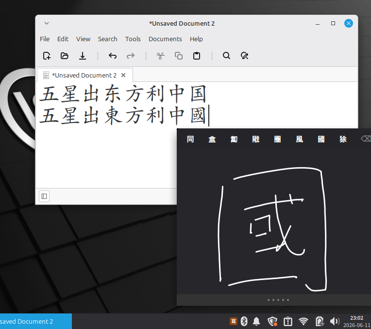

# IBus 中文手寫輸入法

[](https://github.com/vinceyap88/ibus-handwrite-chinese/actions/workflows/ci.yml)
[](https://github.com/vinceyap88/ibus-handwrite-chinese/actions/workflows/test-release-v0.1.0.yml)

一款 Linux 平臺的中文手寫輸入法，採用 macOS 風格浮動面板、evdev 觸控板整合和 Zinnia 辨識引擎。



## 功能特點

- **macOS 風格彈出面板**：深色浮動視窗，候選詞嵌入面板頂部
- **evdev 觸控板輸入**：在筆記型電腦觸控板上書寫漢字 —— 支援所有支援 BTN_TOUCH + ABS_X/ABS_MT_POSITION_X 的現代觸控板（Synaptics、ELAN、ALPS、bcm5974）
- **點擊選擇**：輕觸觸控板即可選擇候選詞 —— 空間映射匹配候選詞位置
- **雙指滑動**：雙指左右滑動翻頁瀏覽候選詞
- **刪除筆畫**：⌫ 按鈕可撤銷上一筆畫
- **關閉按鈕**：左上角始終顯示 × 按鈕，點擊關閉並恢復上一輸入法
- **ESC 狀態機**：按一次 ESC 暫停（釋放觸控板，顯示「已暫停」遮罩），再按一次 ESC 關閉並恢復上一輸入法；點擊視窗恢復
- **智慧視窗定位**：彈出面板自動避開當前活動視窗，不遮擋應用程式畫面
- **拖曳手柄**：頂部欄自訂拖曳手柄可隨意移動視窗位置
- **滑鼠備用**：如無 evdev 觸控板，可使用滑鼠繪圖

## 跨發行版支援

`bootstrap.sh` 自動檢測您的 Linux 發行版並安裝全部依賴：

| 發行版 | 安裝方式 | 模型來源 |
|--------|----------|----------|
| Debian 12+, Ubuntu 22.04+, Mint 21+ | `apt` + 鏡像下載 | 系統套件 + 幽蘭百合（首選 Gitee，備用 GitHub） |
| Fedora 39+ | `dnf` + 下載 | tegaki + 幽蘭百合模型 |
| Arch Linux, Manjaro | `pacman` + `yay` (AUR) + 下載 | tegaki + 幽蘭百合模型 |
| openSUSE Tumbleweed | `zypper` + 下載 | tegaki + 幽蘭百合模型 |

安裝程式從 [tegaki GitHub releases](https://github.com/tegaki/tegaki-models/releases) 下載 tegaki v0.3 模型（`zh_CN.model` — 6763 字，`zh_TW.model` — 11853 字），並從 [Gitee](https://gitee.com/LZQingXi/handwriting-zh_CN_Community) 下載 **幽蘭百合 Community v1.1.0** 模型（`ZJHandWriting-zh_CN.model` — 9374 字）。簡體中文以幽蘭百合為主要辨識器，tegaki zh_CN 為備用。繁體中文使用獨立模型 tegaki zh_TW（11853 字）。

## 系統需求

- Linux 系統，帶觸控板（或觸控螢幕）
- IBus 輸入法框架（大多數桌面環境預設安裝）
- **Debian 系列**：Debian 11+、Ubuntu 22.04+、Linux Mint 21+
- **Fedora**：Fedora 40+
- **Arch**：Arch Linux、Manjaro（zinnia 來自 AUR）
- **openSUSE**：Tumbleweed（Leap 不提供 zinnia）

## 快速安裝

```bash
bash <(curl -s https://raw.githubusercontent.com/vinceyap88/ibus-handwrite-chinese/main/bootstrap.sh)
ibus restart
```

**Debian/Ubuntu/Mint** 使用者也可使用傳統方式：

```bash
sudo apt install python3-evdev tegaki-zinnia-simplified-chinese tegaki-zinnia-traditional-chinese
git clone https://github.com/vinceyap88/ibus-handwrite-chinese
cd ibus-handwrite-chinese
sudo ./install.sh          # 已安裝依賴可加 --skip-deps
ibus restart
```

`install.sh` 自動下載缺失的模型：tegaki 繁體模型從 GitHub 獲取，幽蘭百合 Community v1.1.0 模型（9374 字）從 Gitee 獲取，用於提升簡體中文辨識精度。

切換輸入法：

```bash
ibus engine handwrite-chinese-simplified   # 簡體中文
ibus engine handwrite-chinese-traditional  # 繁體中文
```

或者從桌面環境的 IBus 選單中選擇 **Chinese Handwriting (Simplified)** 或 **Chinese Handwriting (Traditional)**。

## 使用方法

1. 從 IBus 選單切換到 **Chinese Handwriting (Simplified)** 或 **Chinese Handwriting (Traditional)**
2. 深色浮動面板將在螢幕右下角出現
3. 用單指在觸控板上書寫漢字
4. 候選字顯示在面板頂部
5. 輕觸觸控板選擇候選詞（空間映射）
6. 雙指左右滑動翻頁
7. 按 **⌫** 撤銷上一筆畫
8. 點擊面板左上角 **×** 關閉並恢復上一輸入法，或按 **ESC** 暫停（釋放觸控板）
9. 再按 **ESC** 關閉並恢復上一輸入法
10. 點擊面板恢復（暫停狀態下）

## 疑難排解

- **觸控板無法使用**：執行 `sudo udevadm trigger` 套用 udev 規則，或將使用者加入 `input` 群組：`sudo usermod -a -G input $USER && reboot`
- **IBus 未辨識輸入法**：安裝後執行 `ibus restart`
- **輸入法無法啟動**：切換到輸入法時查看 `journalctl -f` 取得錯誤訊息
- **權限被拒絕**：用 `getfacl /dev/input/event*` 驗證 —— 您的使用者應對觸控板裝置有 `rw` 權限

## 測試

兩個 CI 工作流程在每次推送時執行：

### 主 CI

[主 CI](.github/workflows/ci.yml) 在 5 個 Docker 容器中執行：
- **lint**：shellcheck、xmllint、Python 語法檢查
- **test-install**：按發行版安裝依賴，驗證 `libzinnia.so` 載入，檢查 Python 語法
- **test-bootstrap**：完整執行 bootstrap.sh，驗證安裝檔案和模型，執行辨識冒煙測試

測試容器：`debian:bookworm`、`ubuntu:24.04`、`fedora:latest`、`archlinux:latest`、`opensuse/tumbleweed`。

### v0.1.0 發佈測試

[v0.1.0 發佈測試](.github/workflows/test-release-v0.1.0.yml) 在 **10 個發行版版本** 上驗證：

| 發行版 | libzinnia | evdev | 模型 | 引擎 |
|--------|-----------|-------|------|------|
| Debian 11 | ✅ | ✅ | ✅ | ✅ |
| Debian 12 | ✅ | ✅ | ✅ | ✅ |
| Ubuntu 22.04 | ✅ | ✅ | ✅ | ✅ |
| Ubuntu 24.04 | ✅ | ✅ | ✅ | ✅ |
| Fedora 40 | ✅ | ✅ | ✅ | ✅ |
| Fedora 41 | ✅ | ✅ | ✅ | ✅ |
| Fedora latest | ✅ | ✅ | ✅ | ✅ |
| Arch Linux | ✅ | ✅ | ✅ | ✅ |
| openSUSE Leap | ❌（源中無） | ✅ | ✅ | ✅ |
| openSUSE Tumbleweed | ✅ | ✅ | ✅ | ✅ |

### 辨識冒煙測試

辨識冒煙測試（`tests/test_recognition.py`）建立合成筆畫：
- 水平線 → 辨識為 **一**（得分 > 0.9）
- 十字形 → 辨識為 **十**（得分 > 0.95）

CI 不測試 IBus、evdev 或 GTK（容器無顯示/硬體）。

## 已知限制

- **實機測試**：在 MacBook Pro（bcm5974）上測試通過 —— 應適用於任何支援 `BTN_TOUCH + ABS_X` 的觸控板，但 Fedora/Arch 上的 Wayland 彈出面板定位和 SELinux evdev 存取尚未測試
- **辨識精度**：簡體中文以幽蘭百合 Community v1.1.0 模型（9374 字）為主，tegaki zh_CN（6763 字）為備用。實際手寫測試（MacBook 觸控板，20 個常用字）約 80% 首選辨識率。繁體中文使用 tegaki zh_TW（11853 字）
- **單字輸入**：暫不支援多字組合（一次輸入一個字）。V2 版本可能加入空間分割實現連續輸入
- **openSUSE Leap**：zinnia 函式庫在 Leap 16.0 預設來源中不可用。請使用 openSUSE Tumbleweed，或從 OBS 手動安裝 zinnia
- **第三方模型**：幽蘭百合模型託管在 Gitee（中國）。如果 Gitee 無法訪問，安裝程式將回退到本地 `models/` 快取，或發出警告並繼續。CI 容器優雅跳過下載

## 授權條款

GPLv3 — 由相依函式庫要求（libzinnia、python3-evdev、ibus）。

## 軟體套件

預先建置的軟體套件可在 [GitHub Release](https://github.com/vinceyap88/ibus-handwrite-chinese/releases) 頁面下載：

| 格式 | 安裝命令 | 發行版 |
|------|----------|--------|
| `.deb` | `sudo dpkg -i <file> && sudo apt install -f` | Debian 11+, Ubuntu 22.04+, Mint 21+ |
| `.rpm` | `sudo rpm -i <file>` | Fedora 40+, openSUSE Tumbleweed |
| `PKGBUILD` | 參考 `packaging/PKGBUILD` | Arch Linux（需手動提交到 AUR）|

軟體套件在推送標籤時由 CI 自動建置。安裝後自動下載 tegaki 模型（GitHub）和幽蘭百合模型（Gitee，非致命失敗）。

## 目錄結構

```
├── src/
│   ├── ibus-engine-handwrite-chinese    主引擎（Python、Zinnia ctypes、GTK 彈出面板、evdev 整合）
│   └── handwrite_evdev.py               Evdev 多點觸控讀取模組
├── xml/
│   ├── handwrite-chinese-simplified.xml IBus 元件：簡體中文
│   └── handwrite-chinese-traditional.xml IBus 元件：繁體中文
├── icons/
│   ├── handwrite-chinese-simplified.svg 引擎圖示：簡體
│   └── handwrite-chinese-traditional.svg 引擎圖示：繁體
├── tools/
│   ├── install.sh                       安裝指令碼（Debian 原生，支援 `--skip-deps`）
│   ├── restore.sh                       回滾/恢復指令碼
│   └── 99-trackpad-handwrite.rules      觸控板存取的 udev 規則
├── tests/
│   ├── test_recognition.py             合成筆畫辨識冒煙測試
│   └── test_data/                      測試筆畫資料
├── docs/
│   ├── screenshot.png                   應用截圖
│   ├── plan-handwriting-accuracy-test.md tegaki 與幽蘭百合精度對比測試方案
│   └── multi-char-composition-with-phrase-boost-plan.md  V2 功能規劃
├── models/                              本地模型快取（gitignore）
├── packaging/                            Debian 打包、RPM spec、PKGBUILD
├── .github/workflows/
│   ├── ci.yml                          主 CI — 5 個發行版
│   └── test-release-v0.1.0.yml         v0.1.0 發佈測試 — 10 個發行版版本
├── bootstrap.sh                        跨發行版安裝入口
├── README.md
├── README.zh-CN.md
└── README.zh-TW.md
```
